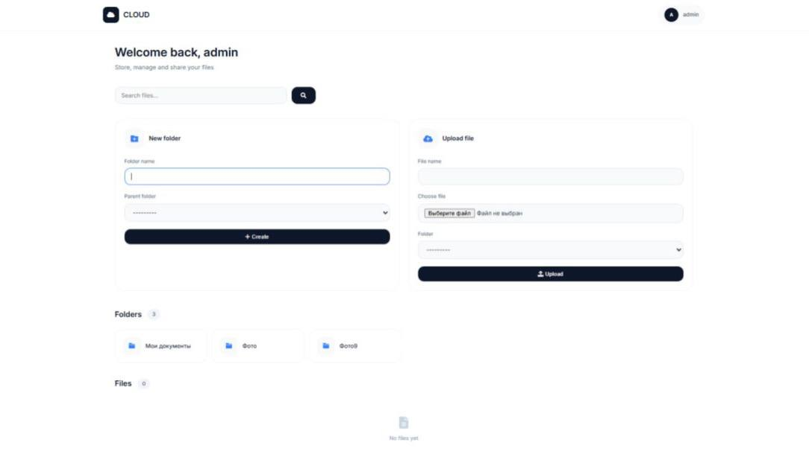

# CLOUD — Modern Cloud Storage

<p align="center">
  
</p>

A modern cloud storage application built with Django. Upload, manage and organize your files with an intuitive interface.

## Features

- **Folders** — Create and organize files in folders
- **Upload** — Easy file upload
- **Favorites** — Mark important files
- **Trash** — Soft delete with restore option
- **Search** — Quick file search
- **Responsive** — Works on all devices

## Tech Stack

- Backend: Django 4.2
- Database: SQLite
- Frontend: HTML5, CSS3, JavaScript

## Installation

```bash
# Clone repository
git clone https://github.com/yourusername/cloud.git
cd cloud

# Create virtual environment
python -m venv venv
# Windows:
venv\Scripts\activate
# Mac/Linux:
source venv/bin/activate

# Install dependencies
pip install -r requirements.txt

# Apply migrations
python manage.py migrate

# Create superuser
python manage.py createsuperuser

# Run server
python manage.py runserver
Open in your browser.
